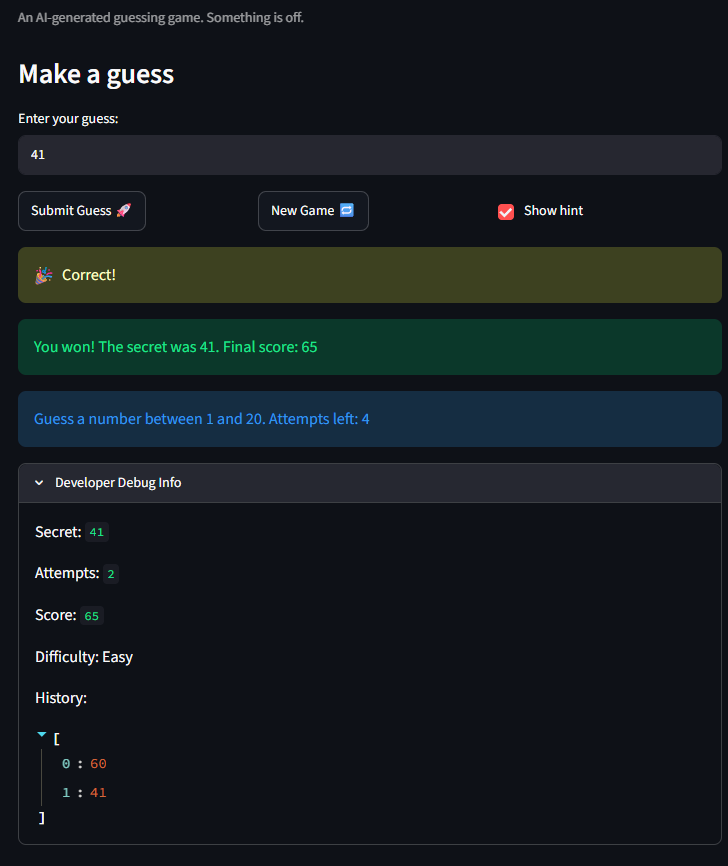
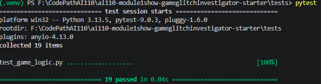
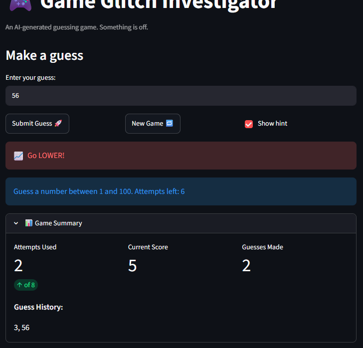

# 🎮 Game Glitch Investigator: The Impossible Guesser

## 🚨 The Situation

You asked an AI to build a simple "Number Guessing Game" using Streamlit.
It wrote the code, ran away, and now the game is unplayable.

- You can't win.
- The hints lie to you.
- The secret number seems to have commitment issues.

## 🛠️ Setup

1. Install dependencies: `pip install -r requirements.txt`
2. Run the broken app: `python -m streamlit run app.py`

## 🕵️‍♂️ Your Mission

1. **Play the game.** Open the "Developer Debug Info" tab in the app to see the secret number. Try to win.
2. **Find the State Bug.** Why does the secret number change every time you click "Submit"? Ask ChatGPT: _"How do I keep a variable from resetting in Streamlit when I click a button?"_
3. **Fix the Logic.** The hints ("Higher/Lower") are wrong. Fix them.
4. **Refactor & Test.** - Move the logic into `logic_utils.py`.
   - Run `pytest` in your terminal.
   - Keep fixing until all tests pass!

## 📝 Document Your Experience

- The game is design to generate a secret number within a range, based on difficulty, that the player needs to guess in a limited amount of attempts also based on the difficulty selected. The game ends once the player accurately guesses the secret.
-

1. Game starts with less attempts than expected.
2. Gives the wrong hint after a failed guess.
3. Provides the same range of guesses regardless of difficulty
4. Developer debug information updates inaccurately.

-

1. changed session_state_attempts at launch (line 34) to 0 instead of 1
2. condition statement in check_guess function hinted to go lower for lower guess and higher for higher guesses. Changed the lower and higher hints to higher and lower respectively.
3. formated the string to get values for difficulties ranges.
4. Moved the streamlit expander "dev debug info" to bottom of file.

## 📸 Demo Walkthrough

1. User selects difficulty (Normal)
2. Game displays 8 attempts available and generate a secret number (41)
3. User enters a guess of 60 -> "Too High, Go Lower"
4. Number of attempts is reduced by 1
5. Developer debug info tool updates accordingly
6. Game ends with correct guess or after all attempts are exhausted

## 🧪 Test Results

## 🚀 Stretch Features

- The background of the hints are now blue for "too low" guesses and red for "too high" gesses. A summary table has also been added for the player to keep track of progress 
